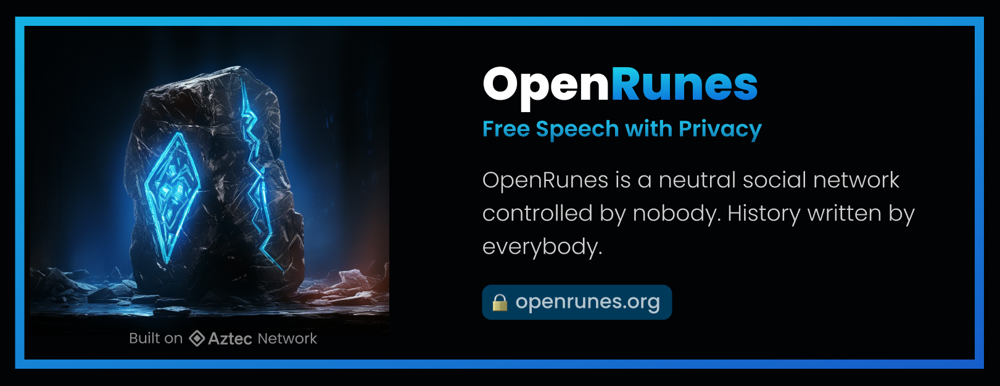

# OpenRunes

OpenRunes is a neutral social network owned by nobody.

- Free speech with privacy
- History written by anyone
- Available forever

OpenRunes is an "immortal app" because it lives forever on the blockchain. It runs as code without a corporation, is immune to censorship, and impossible to shut down. It uses zero-knowledge proofs to preserve privacy.

This makes it a perfect place for anyone to write history.

## OpenRunes vs Traditional Social

OpenRunes is designed for free speech & privacy. It is comparable to traditional social networks like Twitter, Reddit & Weibo. However there are major differences.

| Feature   | Traditional Social Network          | OpenRunes           |
|------|---------------|-----------------------|
| Type    | Wide Variety    | Microblogging |
| Media    | Text, Image, Video, Threads      | Same |
| Users    | General Public      | Same |
| Cost    | 100% Free      | Free to read, Gas fee to post |
| Account Creation    | Email, Phone or GovtID    | Permissionless |
| Privacy    | Account Level    | Post & Account Level |
| Algorithm Feed    | Corporate Policy    | User Customized |
| Content Moderation    | Corporate Policy    | User Customized |
| Controlled By    | Corporate Owner    | No Owner |
| Hosted On    | Private Clouds    | Public Blockchain |
| Business Model    | Sell Advertising      | Pay-per-use public utility |

## Blockchain
OpenRunes is currently being written for Aztec Network, a privacy layer 2 for Ethereum.

## Contact Us
Twitter: `@OpenRunes`
Email: `openrunes.org@gmail.com`

## Contributing
OpenRunes is currently in development. If you would like to contribute, please contact us.

## License
Open source MIT License
